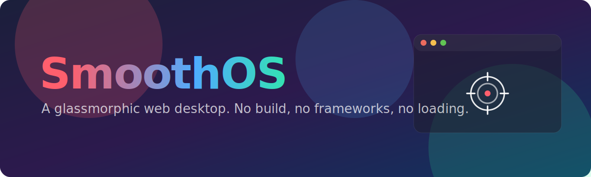

<p align="center">
  
</p>

# SmoothOS

A glassmorphic web desktop built with plain HTML, CSS, and JavaScript. No frameworks, no build step, no CDN, no loading screen. Open `index.html` and it runs.

The goal: a desktop environment that feels as smooth as a native OS, with draggable, resizable, minimizable windows and a clean, convention-based architecture that makes adding new apps trivial.

## Highlights

- **Zero dependencies.** One HTML file, one stylesheet, a handful of JS modules. Fully offline.
- **Smooth by design.** Hardware-friendly CSS transitions, glassmorphism (`backdrop-filter`), animated gradient backdrop with floating colour blobs.
- **Real window manager.** Drag, raise (z-stacking), close, minimize to dock, maximize, and resize from every edge and corner.
- **Convention-based apps.** New windows need only HTML. Wiring is automatic via `data-*` attributes.

## Window management

| Action | How |
|--------|-----|
| Move | Drag the window header |
| Raise | Click anywhere on a window |
| Close | Red traffic light, or any `[data-close]` element |
| Minimize | Yellow traffic light. Drops a chip in the dock; click to restore |
| Maximize | Green traffic light. Toggles full-screen with a 24px gap |
| Resize | Drag any edge or corner (8 handles) |

## Apps

- **Aim Trainer** — a 10-second click-the-target game. Targets spawn without overlapping, score tracks live, a result panel offers a replay. The window grows to a fixed play size and re-centers vertically each round.
- **Settings** (in progress) — wallpaper, accent colour, and blob toggles.
- **Welcome** — the intro window.

<!-- Screenshots: drop PNGs into docs/ and uncomment.
<p align="center">
  
  
</p>
-->

## Architecture

The window manager (`script.js`) wires everything by convention at load, so apps stay decoupled from it.

- Any `.window` becomes draggable, raisable, and resizable, and gets standard chrome (traffic lights + centered title) built from its `data-title`.
- `[data-open="id"]` opens the window with that id.
- `[data-close]`, `[data-minimize]`, `[data-maximize]` act on their parent window.

Adding an app is just markup:

```html
<div class="window" id="myapp" data-title="My App" style="top: 120px; left: 120px;">
  <div class="windowbody">
    <!-- app content -->
  </div>
</div>
```

App logic lives in its own IIFE module (see `aim.js`) exposing a small API, included with one more `<script>` tag. No edits to the window manager required.

## File structure

```
index.html     markup: desktop, icons, windows, dock
style.css      all styling and animations
script.js      window manager (drag, resize, open/close, minimize, dock)
aim.js         Aim Trainer app module
settings.js    Settings app module (in progress)
docs/          README assets
```

## Running

No tooling needed.

```
open index.html
```

Or serve the folder with any static server (e.g. `python3 -m http.server`) and visit the printed URL.

## Roadmap

- Persist open windows and their geometry to `localStorage`
- Focused vs. unfocused window styling
- Keyboard shortcuts (Esc to close, double-click header to maximize)
- Snap-to-edge while dragging
- More apps: Calculator, Notes, Clock

## License

MIT
